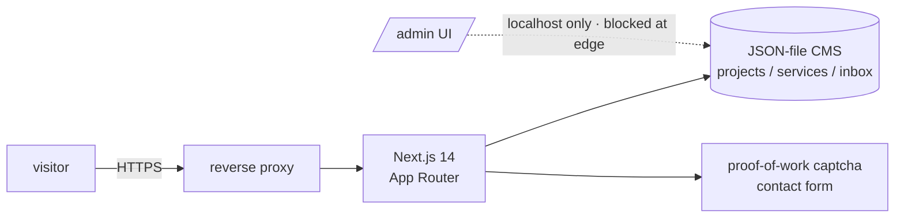

# sami-portfolio (djouhri.de)

Source of my personal portfolio and CV site, [djouhri.de](https://djouhri.de).
Built with Next.js 14 (App Router) and a small self-hosted JSON CMS. It is
bilingual (DE and EN) and deployed on my own infrastructure behind a reverse
proxy, not on a managed platform.

## Stack
- **Next.js 14**, TypeScript, Tailwind CSS
- **JSON-file CMS** for projects, services and the contact inbox. The `/admin`
  UI is bound to localhost only and blocked at the edge
- Self-contained proof-of-work captcha for the contact form, with no third-party
  widget
- **Hardened container**: read-only root filesystem, non-root user, dropped
  capabilities, `no-new-privileges`, memory-limited

## Structure
- `app/`: routes (App Router), API routes, PDF CV renderer
- `lib/`: content model, i18n dictionary, CV and projects data
- `Dockerfile` and `docker-compose.yml`: the runtime

## Notes
Deploy specifics and host details for my own infrastructure have been removed.
This repository is the application code as a portfolio showcase. MIT licensed.

## About this snapshot

This repository is a curated, secret-free extract from a private source repository.
A script performs the extraction: it drops non-public files, rewrites internal
addresses and paths to placeholders, and requires two independent secret scanners
to pass before anything is pushed.

The development history stays private, which is why you see a single commit here
instead of the real timeline. The code itself is not a demo: it runs in my own
infrastructure and is maintained there.
